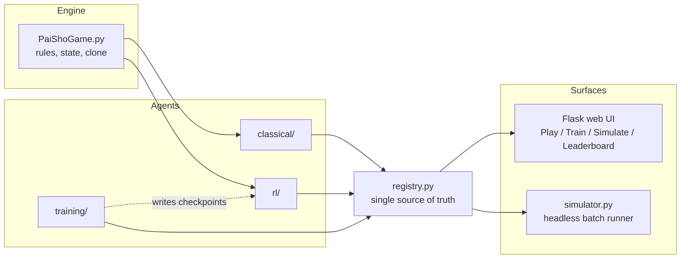

# Architecture

This document explains how the pieces fit together and why they're built the way they are — the engine, the registry-driven agent system, and the design tradeoffs behind each agent family. For setup and usage, see [README.md](README.md).

> Note on scope: this describes the full system, including agents that live in the private upstream research repo. The public template you're reading this in ships a minimal three-agent slice (`random`, `basic_minimax`, `cnn_basic`) — see the "Where this repo comes from" section in the README for why. Everything in the "Agent design spectrum" section below beyond those three describes agents that exist upstream, included here because the tradeoffs are the interesting part, not the specific file.

## System overview

Every agent, its hyperparameters, its training script, and its checkpoint path are declared once in `Agents/registry.py`. The UI's forms, the simulator's `agent:k=v,...` CLI parsing, and the training manager's subprocess wiring all read from that one list — nothing about adding an agent requires touching UI code. This exists because the alternative (each surface hardcoding its own agent list) is exactly the kind of three-way duplication that silently drifts: an agent added to the dropdown but not the simulator, or a hyperparameter renamed in one place and not another. Centralizing it in one declarative list makes "does this agent exist and is it wired up correctly" a property you can check by reading one file.

## Engine internals

The board is a 19×19 grid, but only a subset of coordinates are legal — the game is played on a circular ring of radius 9 around a center point, with 4 gates on the cardinal axes as entry points. `PaiShoGame` represents the board as `dict[(row, col)] -> {'flower': ..., 'player': ..., 'growing': ...}` rather than a dense array, since the legal-space set is sparse relative to the 19×19 bounding box.

Two things worth calling out for anyone reading the engine code:

- **Immutability is a convention, not a type guarantee.** `PaiShoGame` is mutable and cheap to `clone()`; every search-based agent (minimax, MCTS) clones before simulating a candidate move rather than mutating and undoing. This trades a bit of allocation for not having to get move/unmove logic exactly symmetric under bonus turns, wheel rotations, and clash resolution — which is the kind of state machine where an unmove bug silently corrupts search rather than crashing.
- **Zobrist hashing exists purely for the tabular agent's Q-table keys** (`monte_carlo.py`), not for the engine's own state comparisons. It's the standard incremental-hash trick — XOR a random 64-bit number in/out per (square, piece) — so a hash update on a single placement is O(1) instead of re-hashing the whole board.

## Why a registry instead of per-surface config

Concretely, an agent's registry entry supplies: the `choose_action` entry point, UI form fields (with `num_param`/`checkbox_param` helpers), the training script path and its CLI flags, the checkpoint path, and which stdout log-parser format it emits. The Train page's hyperparameter form, the progress bar, and the "model trained ✓" indicator are all *generated* from this — there's no separate "add a form field" step. The cost of this design is a slightly more constrained agent interface (every agent must expose the same shape of metadata); the benefit is that the failure mode for a misconfigured agent is a KeyError at import time, not a silently broken button in the UI three clicks deep.

## Agent design spectrum

The roster spans four different approaches to the same problem — choosing an action in a two-player, imperfect-lookahead-friendly, large-branching-factor board game — deliberately, so the tradeoffs between them are visible side by side rather than theoretical.

| Family | Agent(s) | Core idea | Why this tradeoff |
|---|---|---|---|
| Classical search | `minimax` / `basic_minimax` | Alpha-beta with iterative deepening + transposition table (full) vs. depth-limited with a fixed eval (basic) | Exact within the search horizon, but quality is bottlenecked by hand-written evaluation and by how deep you can afford to go before the clock runs out. `basic_minimax` exists specifically as the "no weights, no training loop" reference template — the cheapest possible agent to reason about. |
| Tree search | `mcts` | UCT with RAVE and progressive widening, heuristic leaf evaluation | Plain UCT converges slowly when simulations are expensive and the branching factor is large (this board easily has dozens of legal actions per turn). RAVE shares value estimates across moves that share a sub-action *before* they've individually been visited much, which matters exactly when simulation budget per node is thin. Progressive widening caps how many children get expanded early, trading some blind spots for not drowning in unexplored branches. |
| Tabular / linear RL | `monte_carlo`, `td_learning` | Q-learning over a Zobrist-hashed state table vs. TD(λ) over a 26-dim hand-crafted feature vector | The tabular agent is exact per-state but has zero generalization — states it hasn't seen are a coin flip. TD(λ) trades exactness for a linear function over hand-picked features, so it can say something reasonable about a state it's never visited, at the cost of however much signal got left out of those 26 features. |
| Neural | `cnn_basic`, `nneu_basic`, `ppo`, `set_transformer` | Grid CNN value net (one-ply greedy) → NNUE-style quantised dual-accumulator net → actor-critic with PPO+GAE → Set Transformer encoder + PPO | `cnn_basic` is the trainable reference template: a plain 8-channel grid encoding is the most obvious way to hand a board to a conv net, and one-ply greedy is the simplest thing that's still a real agent. `nneu_basic` borrows the NNUE architecture from chess engines (Stockfish et al.) — an incrementally-updatable accumulator with an int16-quantised inference path — because search-time evaluation speed matters more than raw expressiveness once you're calling the eval function thousands of times per move. `ppo`/`set_transformer` move from one-ply greedy to an actual learned policy; the Set Transformer specifically encodes the board as a *set* of placed pieces rather than a fixed grid, which is a better match for a sparse board where most squares are empty and piece count varies — a CNN spends most of its receptive field on nothing. |
| Evolutionary | `neat` | NEAT: topology *and* weight coevolution via tournament fitness | No gradient required, which matters because the win condition (a closed harmony ring) is a sparse, delayed, and somewhat brittle reward signal to differentiate through directly. The cost is sample efficiency — evolution needs many more games than a policy gradient method to make comparable progress. |

## Training and evaluation loop

Every trainable agent's training script is self-play (or fixed-opponent, via `Agents/training/opponent_utils.py`'s `load_opponent`), and every script emits structured `EVENT:{...}` JSON lines on stdout ([Agents/logging_utils.py](Agents/logging_utils.py)). That's the entire contract between a training script and the UI: the Train page's progress bar and live metrics are just a parser over those lines, which is why a new agent's training script needs no UI-side changes to get a working progress bar — it needs to log events in the expected shape.

Improvement is made legible the same way a real ML project would: [Agents/elo.py](Agents/elo.py) tracks Elo across simulated tournaments (Simulate page), and ratings reset whenever an agent's weights change, so the leaderboard always reflects the *current* checkpoint rather than a stale rating from three retrains ago.
